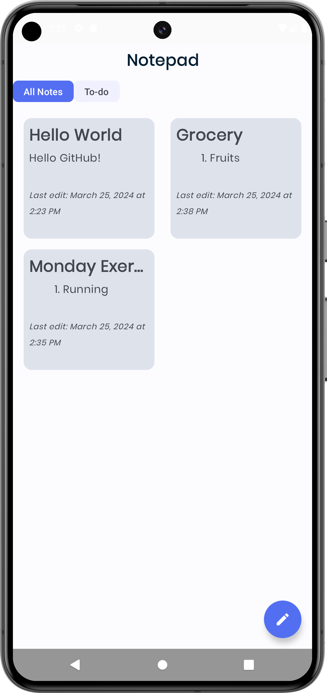
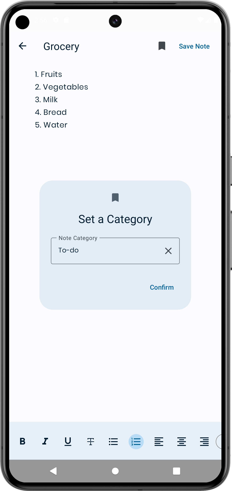

---

# Notepad App 🗒️

## Description
The Notepad App is a simple yet powerful Android application designed to help users easily create, edit, and manage their notes on the go. With a clean and intuitive user interface.

## Features
- **Create and Edit Notes:** Easily create new notes or edit existing ones with a rich text editor.
- **Organize Notes:** Organize your notes into categories or folders for better management.

## Screenshots

  
  

## Installation
1. Clone the repository: `git clone https://github.com/GuilhermeIgnacio/Notepad`
2. Open the project in Android Studio.
3. Build and run the app on your Android device or emulator.
4. Or Download the <a href="https://guilhermeignacio.vercel.app" target ="_blank" >APK</a>

## Requirements
- Android Studio
- Android SDK version 21 or higher

## Contributing
Contributions are welcome! If you'd like to contribute to this project, please follow these steps:
1. Fork the repository.
2. Create a new branch (`git checkout -b feature-branch`).
3. Make your changes.
4. Commit your changes (`git commit -am 'Add new feature'`).
5. Push to the branch (`git push origin feature-branch`).
6. Create a new Pull Request.

---
